# Домашнее задание к занятию "10.03. Grafana"

## Задание 1. Используя директорию [help](./help) внутри данного домашнего задания - запустите связку prometheus-grafana. 
## Зайдите в веб-интерфейс графана, используя авторизационные данные, указанные в манифесте docker-compose.
## Подключите поднятый вами prometheus как источник данных.

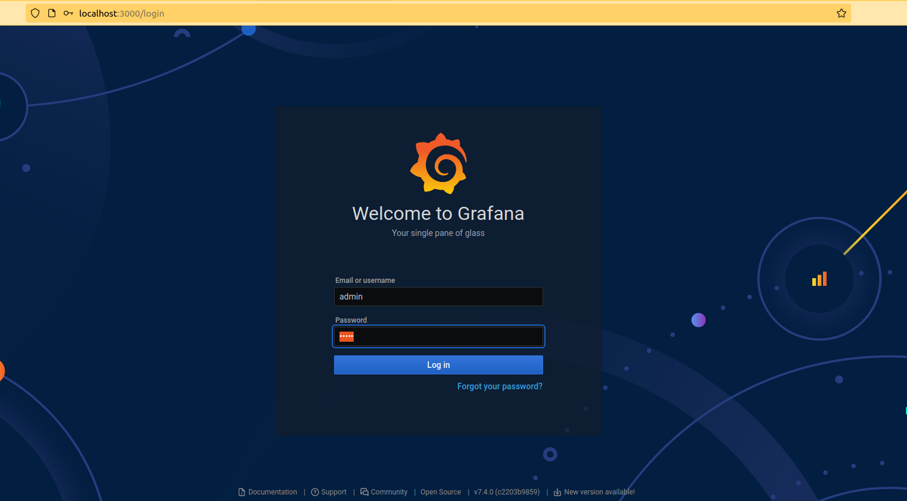

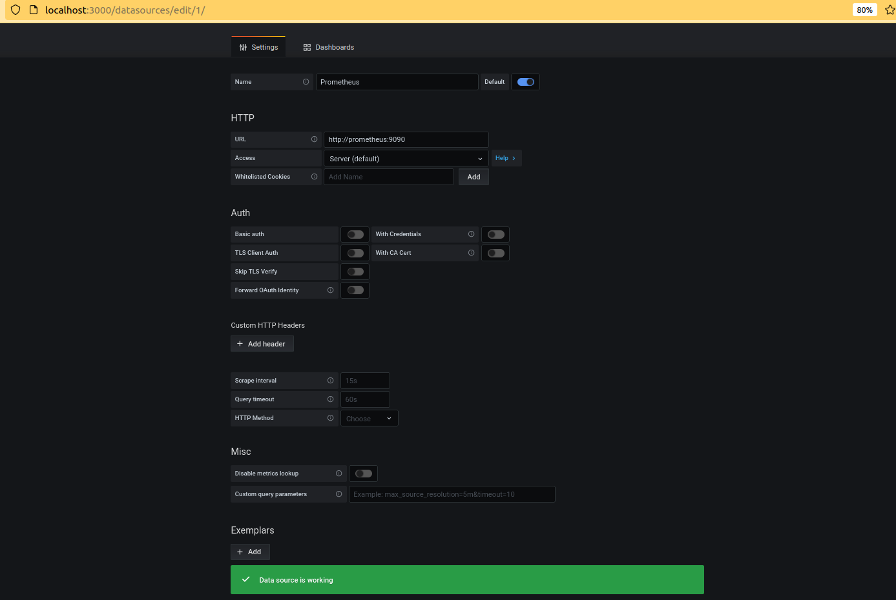

## Задание 2. Изучите самостоятельно ресурсы: - [promql-for-humans](https://timber.io/blog/promql-for-humans/#cpu-usage-by-instance) - [understanding prometheus cpu metrics](https://www.robustperception.io/understanding-machine-cpu-usage)
## Создайте Dashboard и в ней создайте следующие Panels:

### Утилизация CPU для nodeexporter (в процентах, 100-idle)

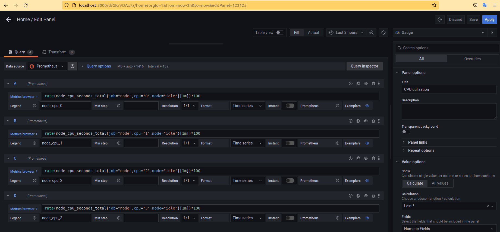

* Для каждого CPU свой номер:

```shell
rate(node_cpu_seconds_total{job="node",cpu="0",mode="idle"}[1m])*100
```
### CPULA 1/5/15

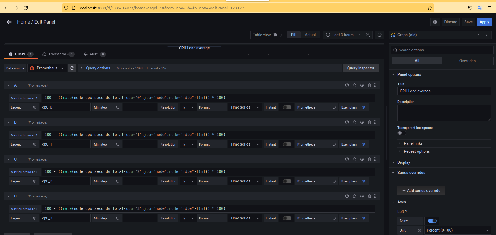

* Для каждого CPU свой номер:

```shell
100 - ((rate(node_cpu_seconds_total{cpu="0",job="node",mode="idle"}[1m])) * 100)
```
### Количество свободной оперативной памяти

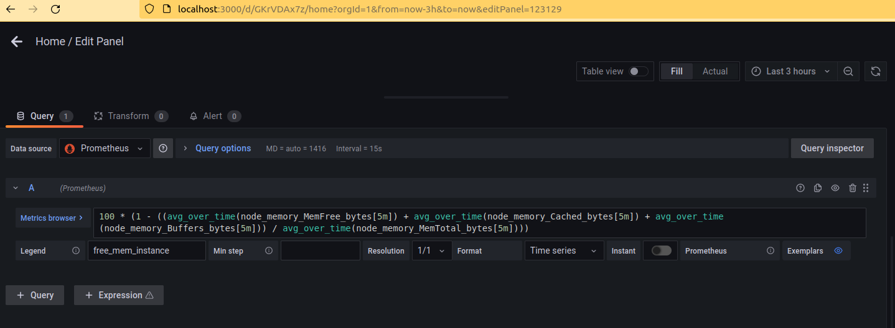

```shell
100 * (1 - ((avg_over_time(node_memory_MemFree_bytes[5m]) + avg_over_time(node_memory_Cached_bytes[5m]) + avg_over_time(node_memory_Buffers_bytes[5m])) / avg_over_time(node_memory_MemTotal_bytes[5m])))
```

### Количество места на файловой системе

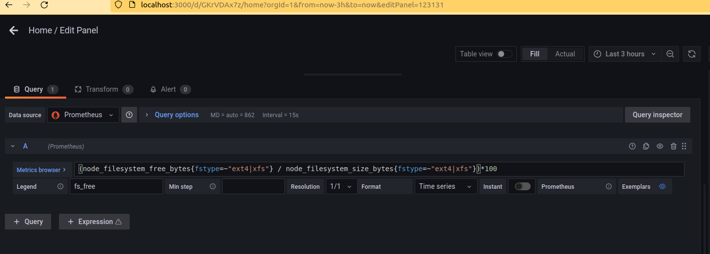

```shell
(node_filesystem_free_bytes{fstype=~"ext4|xfs"} / node_filesystem_size_bytes{fstype=~"ext4|xfs"})*100
```

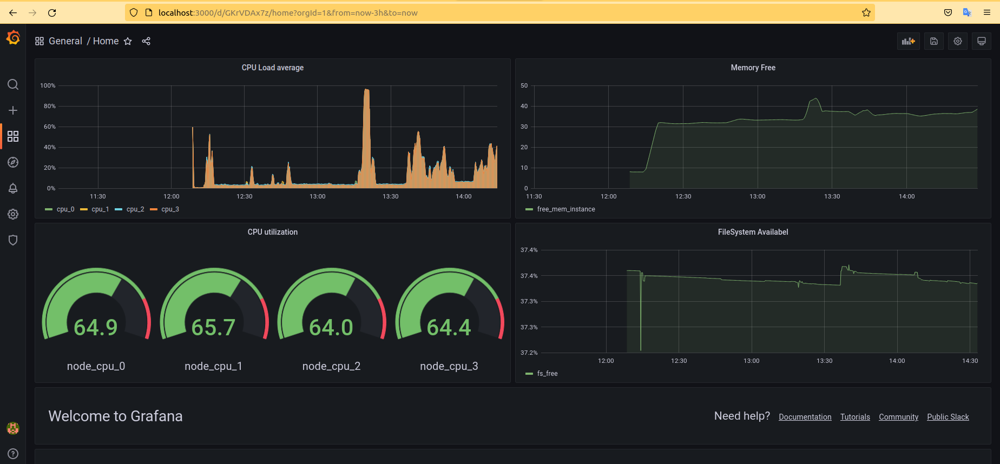

## Задание 3. Создайте для каждой Dashboard подходящее правило alert

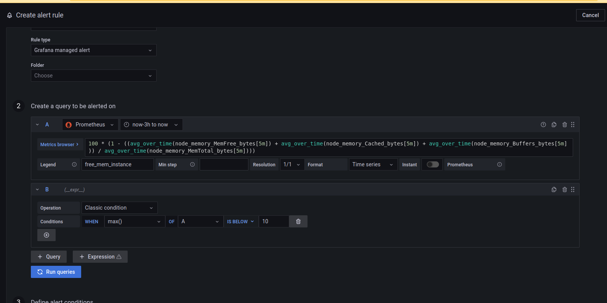

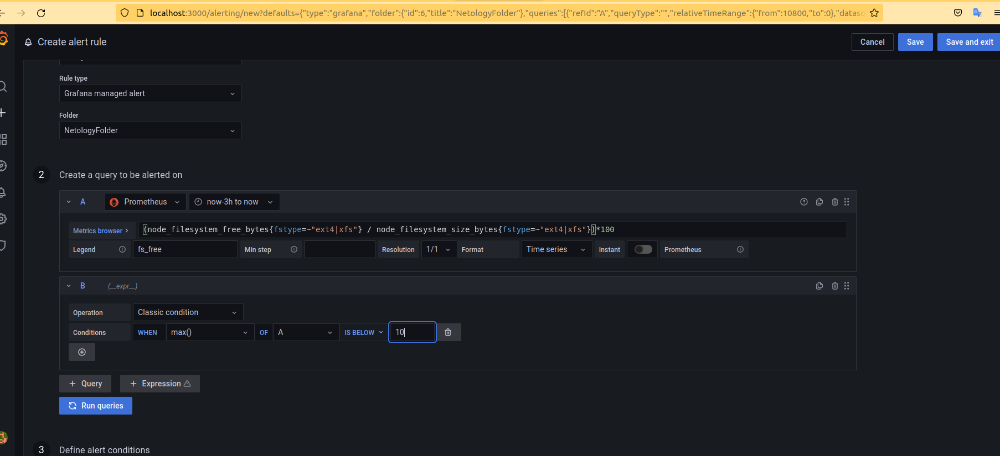

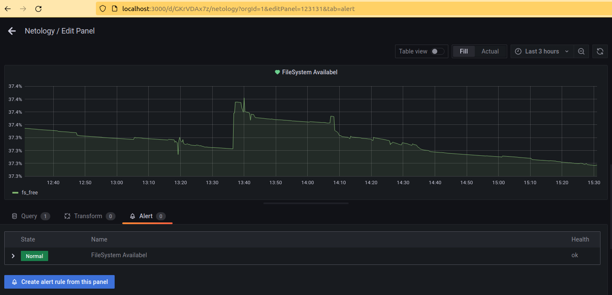


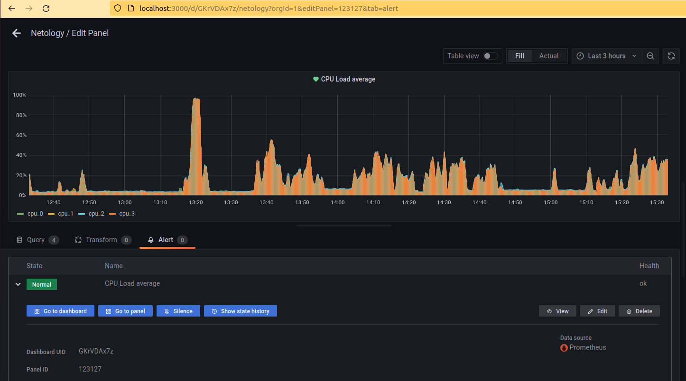

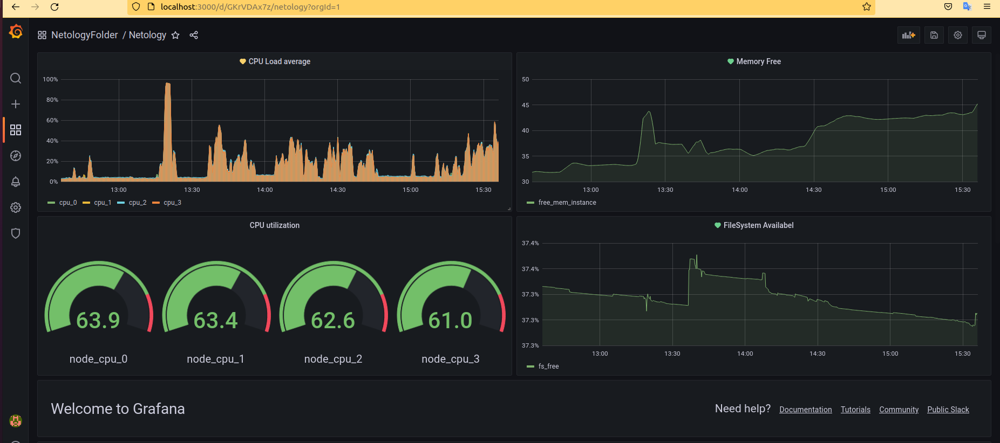

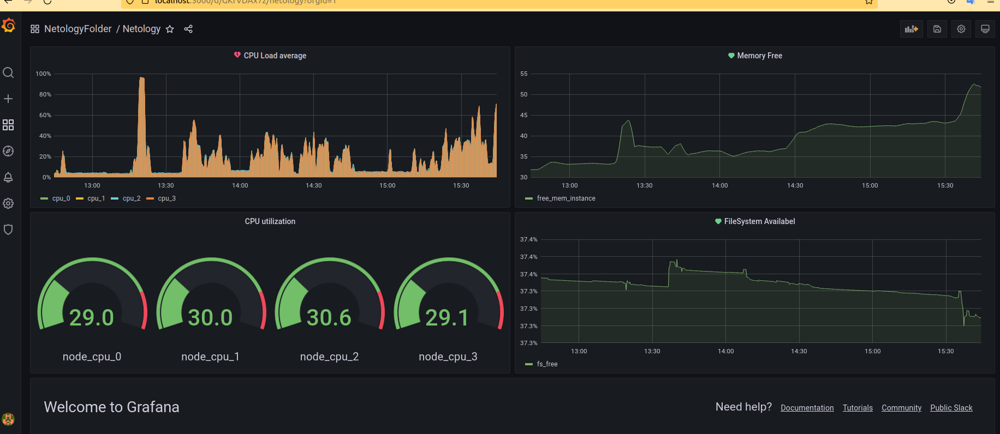

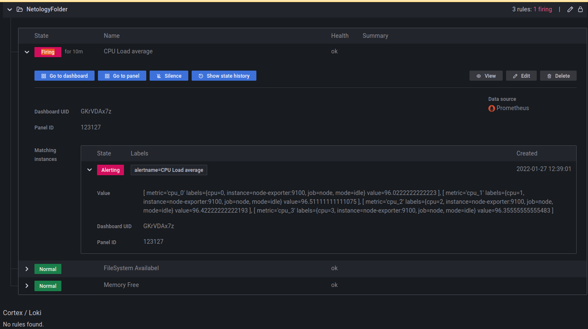

## Задание 4. Сохраните ваш Dashboard.

* [Файлик](dashboard.json) в репозитории
