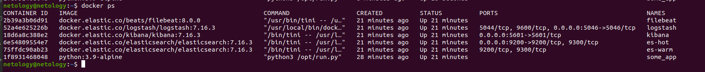

# Домашнее задание к занятию "10.04. ELK"

## Не используйте директорию [help](./help) при выполнении домашнего задания.

* Я пошла по сложному пути - решила запустить ansible-роли с elk-стеком. 
* Возможно это не самое удачное решение, но т.к. я ещё не выполнила задание с тестированием ролей ansible, то потренировалась
* [Репозиторий](https://github.com/lereklerik/elk) с ansible-elk

## Задание 1. Вам необходимо поднять в докере: elasticsearch(hot и warm ноды), logstash, kibana, filebeat

### Скриншот `docker ps` через 5 минут после старта всех контейнеров (их должно быть 5)

### Скриншот интерфейса kibana

### docker-compose манифест (если вы не использовали директорию help)
### Ваши yml конфигурации для стека (если вы не использовали директорию help)

* Все конфигурации, этапы тестирования и запуска описаны в [репозитории](https://github.com/lereklerik/elk) с ansible-elk 

## Задание 2. Перейдите в меню [создания index-patterns в kibana](http://localhost:5601/app/management/kibana/indexPatterns/create) и создайте несколько index-patterns из имеющихся.

Перейдите в меню просмотра логов в kibana (Discover) и самостоятельно изучите как отображаются логи и как производить 
поиск по логам.

В манифесте директории help также приведенно dummy приложение, которое генерирует рандомные события в stdout контейнера.
Данные логи должны порождать индекс logstash-* в elasticsearch. Если данного индекса нет - воспользуйтесь советами 
и источниками из раздела "Дополнительные ссылки" данного ДЗ.