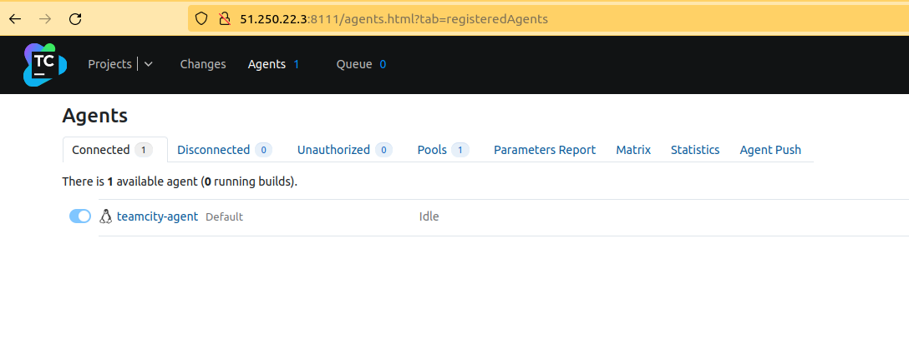
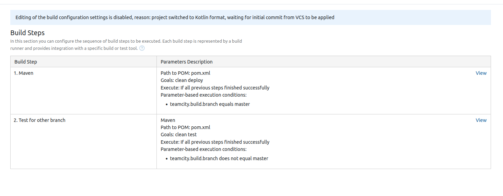

# Домашнее задание к занятию "09.05 Teamcity"

---------------------------------------------------------

* [`.teamcity`](https://github.com/lereklerik/example-teamcity/tree/master/.teamcity) файлы в репозитории

---------------------------------------------------------

## Подготовка к выполнению

---------------------------------------------------------
#### 1. В Ya.Cloud создайте новый инстанс (4CPU4RAM) на основе образа `jetbrains/teamcity-server`


---------------------------------------------------------

#### 2. Дождитесь запуска teamcity, выполните первоначальную настройку


---------------------------------------------------------

#### 3. Создайте ещё один инстанс(2CPU4RAM) на основе образа `jetbrains/teamcity-agent`. Пропишите к нему переменную окружения `SERVER_URL: "http://<teamcity_url>:8111"`
#### 4. Авторизуйте агент



---------------------------------------------------------

#### 5. Сделайте fork [репозитория](https://github.com/aragastmatb/example-teamcity)

* [Репозиторий](https://github.com/lereklerik/example-teamcity)

---------------------------------------------------------

## Основная часть

#### 1. Создайте новый проект в teamcity на основе fork


---------------------------------------------------------

#### 2. Сделайте autodetect конфигурации


---------------------------------------------------------

#### 3. Сохраните необходимые шаги, запустите первую сборку master'a


---------------------------------------------------------

#### 4. Поменяйте условия сборки: если сборка по ветке `master`, то должен происходит `mvn clean deploy`, иначе `mvn clean test`




---------------------------------------------------------

#### 5. Для deploy будет необходимо загрузить [settings.xml](./teamcity/settings.xml) в набор конфигураций maven у teamcity, предварительно записав туда креды для подключения к nexus

* [`settings.xml`](settings.xml)


---------------------------------------------------------

#### 6. В pom.xml необходимо поменять ссылки на репозиторий и nexus


---------------------------------------------------------

#### 7. Запустите сборку по master, убедитесь что всё прошло успешно, артефакт появился в nexus

* Запусков было несколько: повторяла ошибки из лекции. Из-за интереса и невнимательности =)


---------------------------------------------------------

#### 8. Мигрируйте `build configuration` в репозиторий
#### 9. Создайте отдельную ветку `feature/add_reply` в репозитории
#### 10. Напишите новый метод для класса Welcomer: метод должен возвращать произвольную реплику, содержащую слово `hunter`
#### 11. Дополните тест для нового метода на поиск слова `hunter` в новой реплике
#### 12. Сделайте push всех изменений в новую ветку в репозиторий

* Класс `Welcomer.java`:

```java
package plaindoll;

public class Welcomer{
	public String sayWelcome() {
		return "Welcome home, good hunter. What is it your desire?";
	}
	public String sayFarewell() {
		return "Farewell, good hunter. May you find your worth in waking world.";
	}
	public String saySomething() {
		return "Every hunter wants to know where the pheasant is sitting";
	}
	public String sayHunter() {
		return "Funny hunter!";
	}
}
```

* Тест `WelcomerTest.java`

```java
package plaindoll;

import static org.hamcrest.CoreMatchers.containsString;
import static org.junit.Assert.*;

import org.junit.Test;

public class WelcomerTest {
	
	private Welcomer welcomer = new Welcomer();

	@Test
	public void welcomerSaysWelcome() {
		assertThat(welcomer.sayWelcome(), containsString("Welcome"));
	}
	@Test
	public void welcomerSaysFarewell() {
		assertThat(welcomer.sayFarewell(), containsString("Farewell"));
	}
	@Test
	public void welcomerSaysHunter() {
		assertThat(welcomer.sayWelcome(), containsString("hunter"));
		assertThat(welcomer.sayFarewell(), containsString("hunter"));
		assertThat(welcomer.saySomething(), containsString("hunter"));
	}
}
```

* [Лог](logs/01.md) изменений ветки


---------------------------------------------------------

#### 13. Убедитесь что сборка самостоятельно запустилась, тесты прошли успешно


---------------------------------------------------------

#### 14. Внесите изменения из произвольной ветки `feature/add_reply` в `master` через `Merge`

* [Лог](logs/02.md) изменений ветки

---------------------------------------------------------

#### 15. Убедитесь, что нет собранного артефакта в сборке по ветке `master`

* Изменила номер артефакта и запушила изменения в `master`


---------------------------------------------------------

#### 16. Настройте конфигурацию так, чтобы она собирала `.jar` в артефакты сборки


---------------------------------------------------------

#### 17. Проведите повторную сборку мастера, убедитесь, что сбора прошла успешно и артефакты собраны


---------------------------------------------------------


#### 18. Проверьте, что конфигурация в репозитории содержит все настройки конфигурации из teamcity

* [`.teamcity](https://github.com/lereklerik/example-teamcity/tree/master/.teamcity) файлы в репозитории