# Домашнее задание к занятию "09.06 Gitlab"

------------------------------------------------------------------------------------------

* [Ссылка](https://gitlab.com/lerekler/nc-gb/-/tree/main) на проект

------------------------------------------------------------------------------------------
## Подготовка к выполнению

#### 1. Необходимо [зарегистрироваться](https://about.gitlab.com/free-trial/)

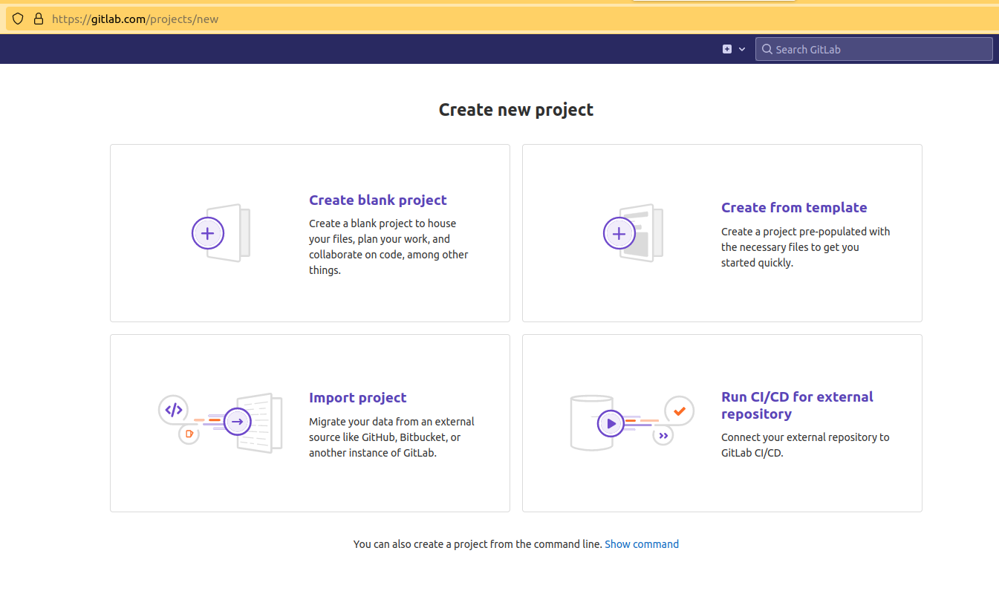

#### 2. Создайте свой новый проект
#### 3. Создайте новый репозиторий в gitlab, наполните его [файлами](./repository)
#### 4. Проект должен быть публичным, остальные настройки по желанию

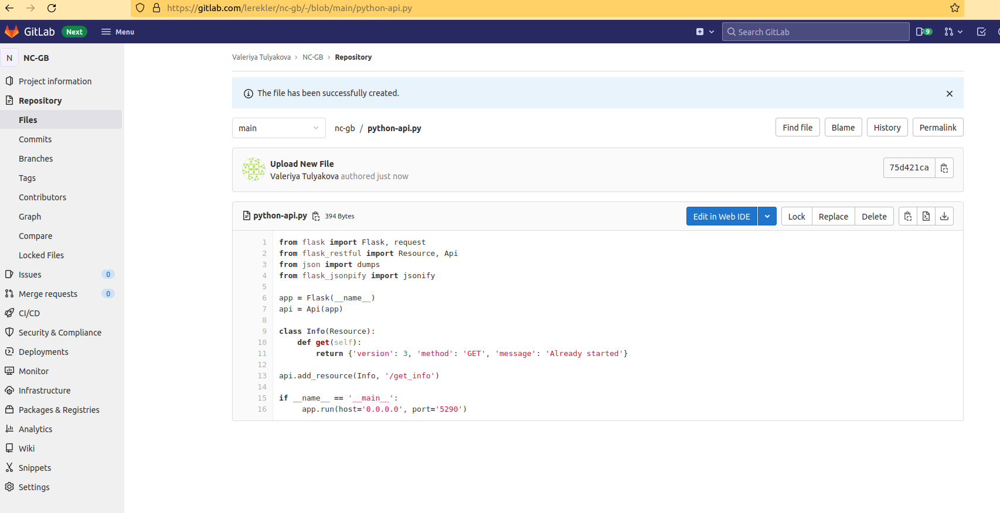

------------------------------------------------------------------------------------------

## Основная часть

### DevOps

#### В репозитории содержится код проекта на python. Проект - RESTful API сервис. Ваша задача автоматизировать сборку образа с выполнением python-скрипта:
#### 1. Образ собирается на основе [centos:7](https://hub.docker.com/_/centos?tab=tags&page=1&ordering=last_updated)
#### 2. Python версии не ниже 3.7
#### 3. Установлены зависимости: `flask` `flask-jsonpify` `flask-restful`
#### 4. Создана директория `/python_api`
#### 5. Скрипт из репозитория размещён в /python_api
#### 6. Точка вызова: запуск скрипта
#### 7. Если сборка происходит на ветке `master`: Образ должен пушится в docker registry вашего gitlab `python-api:latest`, иначе этот шаг нужно пропустить

* Dockerfile (если в `RUN` использовать `yum update`, то возникала ошибка с `pip3`, команда не была найдена [лог](logs/01.md)):

```shell
FROM centos:7

RUN yum install -y python3 python3-pip 

COPY requirements.txt requirements.txt

RUN pip3 install -r requirements.txt

COPY python-api.py /python_api/python-api.py

CMD ["python3", "/python_api/python-api.py"]
```


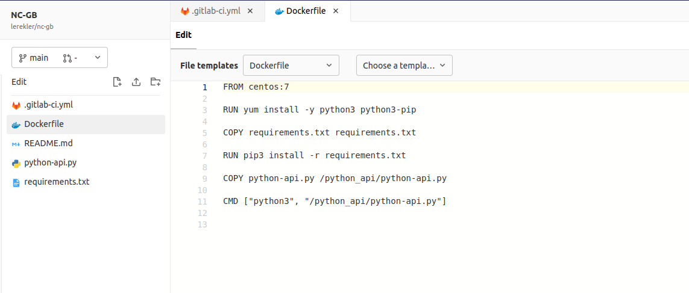

* requirements.txt:

```shell
flask
flask_restful
flask_jsonpify
```

* `gitlab-ci.yml`:

```yaml
stages:
- build
- deploy
image: docker:20.10.5
services:
  - docker:20.10.5-dind
builder: 
  stage: build
  script:
    - docker build -t python-api:dev .
  except:
    - main
deployer:
  stage: deploy
  script:
    - docker build -t $CI_REGISTRY/lerekler/nc-gb/python-api:latest .
    - docker login -u $CI_REGISTRY_USER -p $CI_REGISTRY_PASSWORD $CI_REGISTRY
    - docker push $CI_REGISTRY/lerekler/nc-gb/python-api:latest
  only:
    - main
```

* [Лог](logs/02.md) запуска

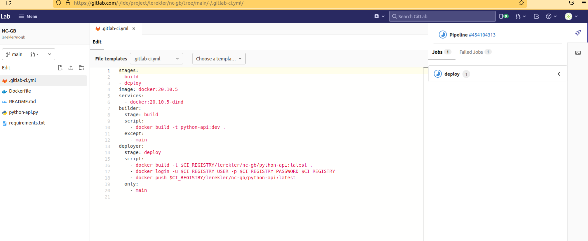

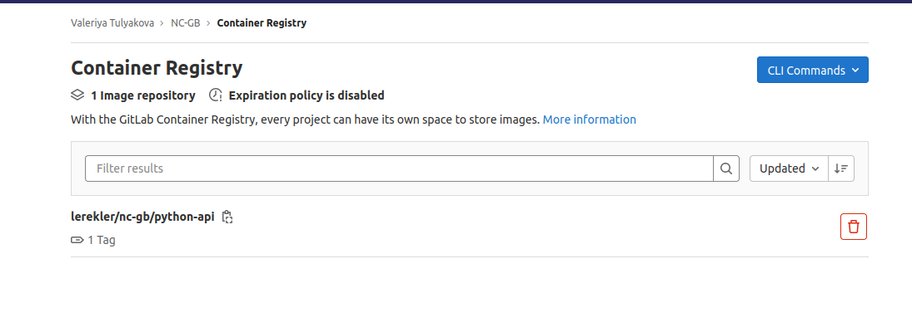

* Добавила новый класс в репозиторий в GitLab:

```java

public class HelloWorld {

    private final static String GITLAB_REPO = "https://gitlab.com/lerekler/nc-gb/-/tree/main"

    public String sayMyRepoAndLogin() {
        Stgring login = "lerekler";
        return "My GitLab repo is " + GITLAB_REPO + " and my login is " + login
    }
}
```

* Запушила изменения:

```shell
netology@netology:~/Projects/nc-gb$ git checkout -b feature-test
Переключено на новую ветку «feature-test»
netology@netology:~/Projects/nc-gb$ git add .
netology@netology:~/Projects/nc-gb$ git commit -m "add new java-class"
[feature-test 65fc722] add new java-class
 1 file changed, 10 insertions(+)
 create mode 100644 HelloWorld.java
netology@netology:~/Projects/nc-gb$ git push origin feature-test 
Перечисление объектов: 19, готово.
Подсчет объектов: 100% (19/19), готово.
При сжатии изменений используется до 4 потоков
Сжатие объектов: 100% (16/16), готово.
Запись объектов: 100% (19/19), 5.23 КиБ | 5.23 МиБ/с, готово.
Всего 19 (изменения 4), повторно использовано 8 (изменения 1)
remote: 
remote: To create a merge request for feature-test, visit:
remote:   https://gitlab.com/lerekler/nc-gb/-/merge_requests/new?merge_request%5Bsource_branch%5D=feature-test
remote: 
To gitlab.com:lerekler/nc-gb.git
 * [new branch]      feature-test -> feature-test
```

* Запустилась другая job'а:

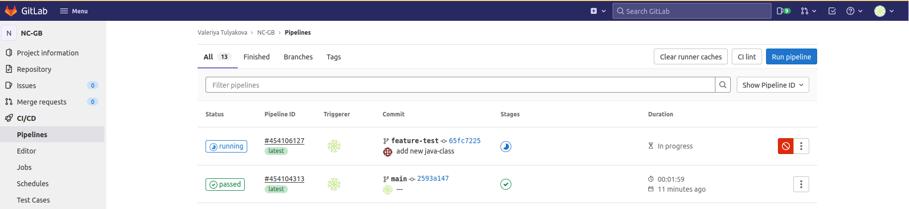

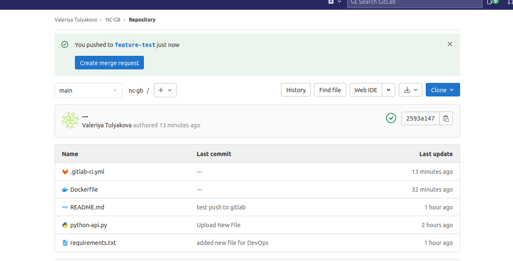

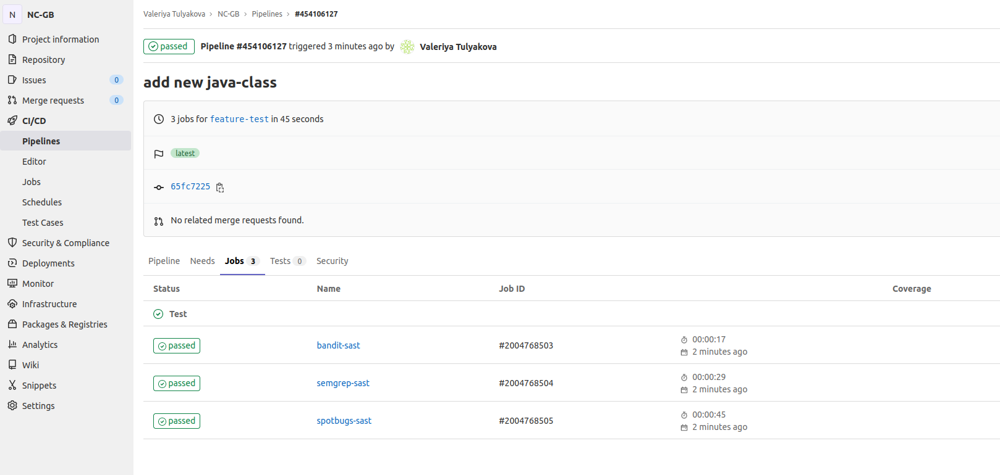

* Проверка работоспособности контейнера:

```shell
netology@netology:~/Projects$ docker login registry.gitlab.com
Username: lerekler
Password: 
WARNING! Your password will be stored unencrypted in /home/netology/.docker/config.json.
Configure a credential helper to remove this warning. See
https://docs.docker.com/engine/reference/commandline/login/#credentials-store

Login Succeeded
netology@netology:~/Projects$ docker pull registry.gitlab.com/lerekler/nc-gb/python-api
Using default tag: latest
latest: Pulling from lerekler/nc-gb/python-api
2d473b07cdd5: Already exists 
4a2ecaf28d48: Pull complete 
240ddde44d3c: Pull complete 
f93d64ced3f8: Pull complete 
0787d493efc8: Pull complete 
Digest: sha256:812ad41851ffe35a9fdb406a5073d5c341bd14efb0197d6d9ab1ebbd60ddbe89
Status: Downloaded newer image for registry.gitlab.com/lerekler/nc-gb/python-api:latest
registry.gitlab.com/lerekler/nc-gb/python-api:latest
netology@netology:~/Projects$ docker run -p 5290:5290 -d registry.gitlab.com/lerekler/nc-gb/python-api:latest 
f0dc03471ffe3495ac33b7a87ffb5b489dc6bb929c54880548468309d168d6ed
netology@netology:~/Projects$ curl localhost:5290/get_info
{"version": 3, "method": "GET", "message": "Already started"}
```
---------------------------------------------------------------------------------------------------

### Product Owner

#### Вашему проекту нужна бизнесовая доработка: необходимо поменять JSON ответа на вызов метода GET `/rest/api/get_info`, необходимо создать Issue в котором указать:
#### 1. Какой метод необходимо исправить
#### 2. Текст с `{ "message": "Already started" }` на `{ "message": "Running"}`
#### 3. Issue поставить label: feature


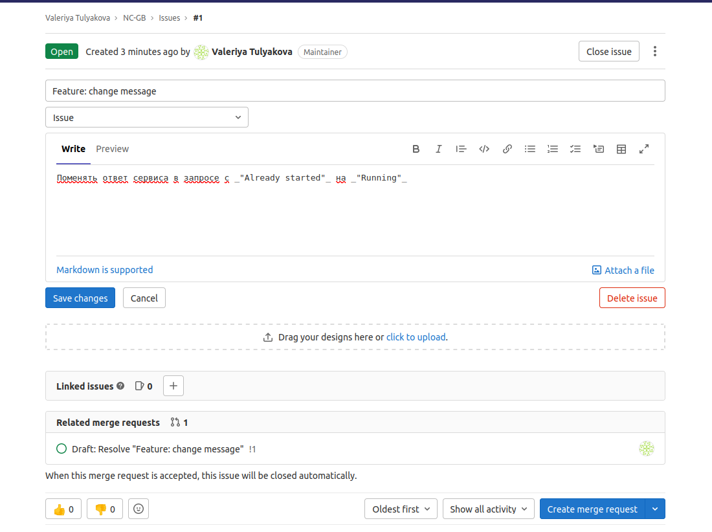

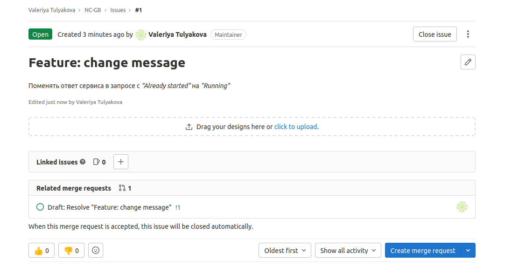

### Developer

#### Вам пришел новый Issue на доработку, вам необходимо:
#### 1. Создать отдельную ветку, связанную с этим issue
#### 2. Внести изменения по тексту из задания
#### 3. Подготовить Merge Requst, влить необходимые изменения в `master`, проверить, что сборка прошла успешно

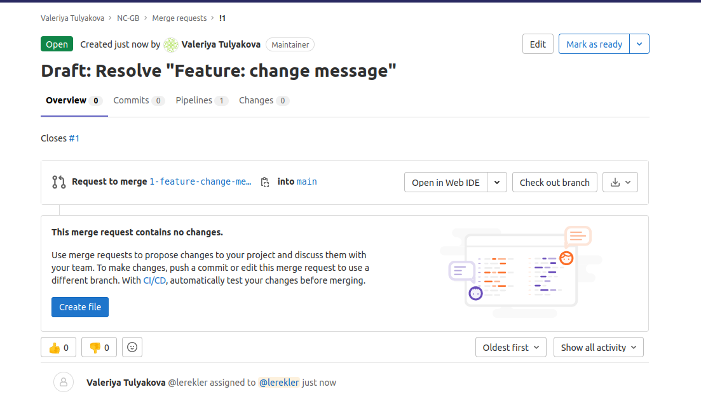

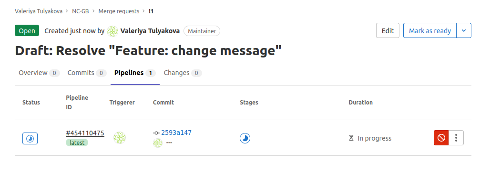

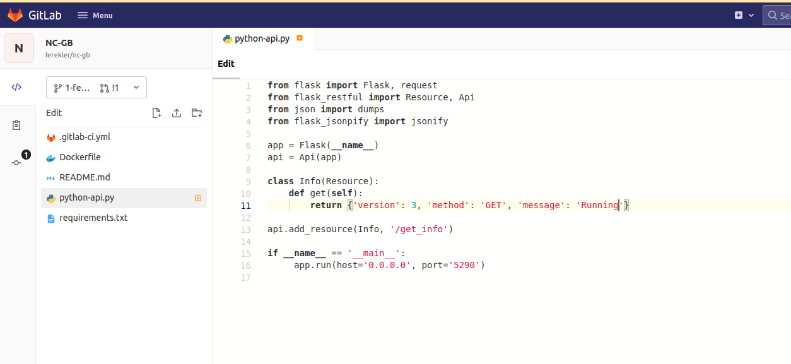

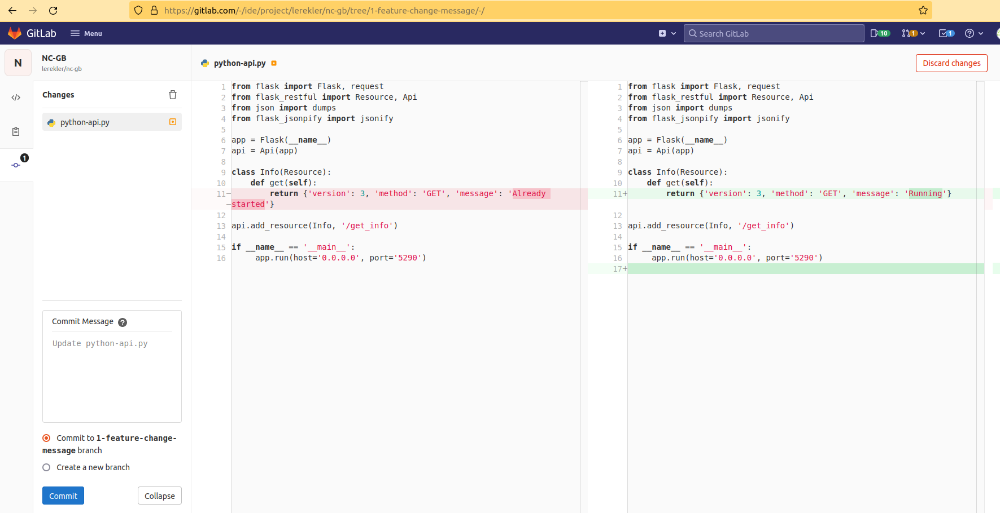

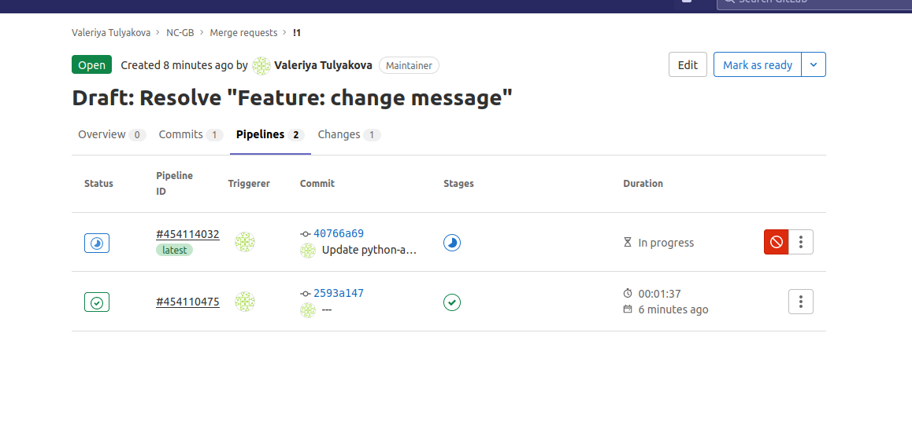

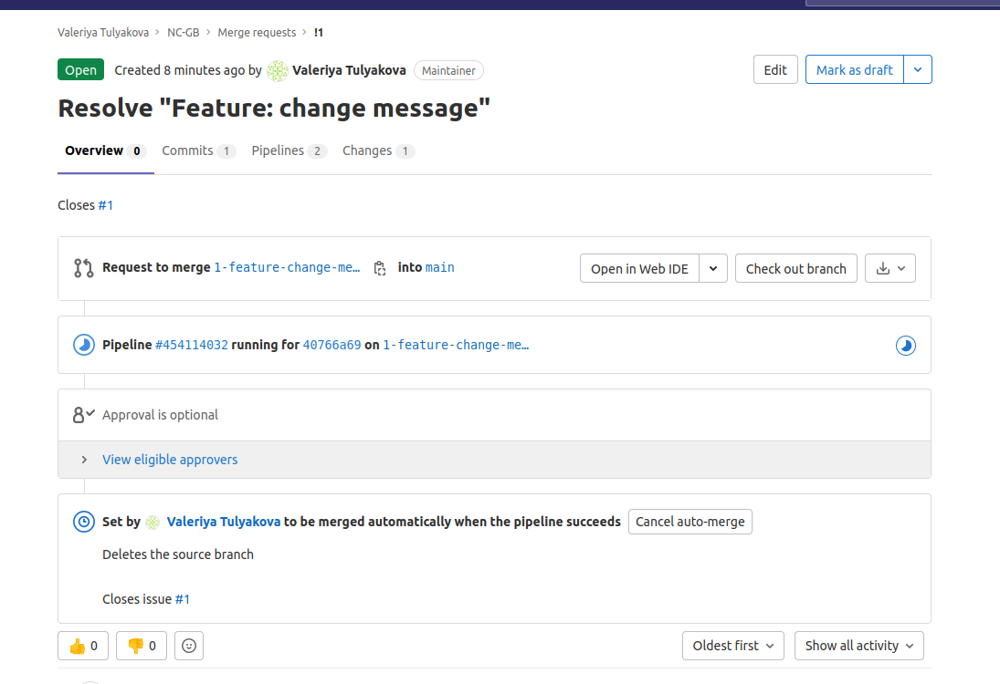

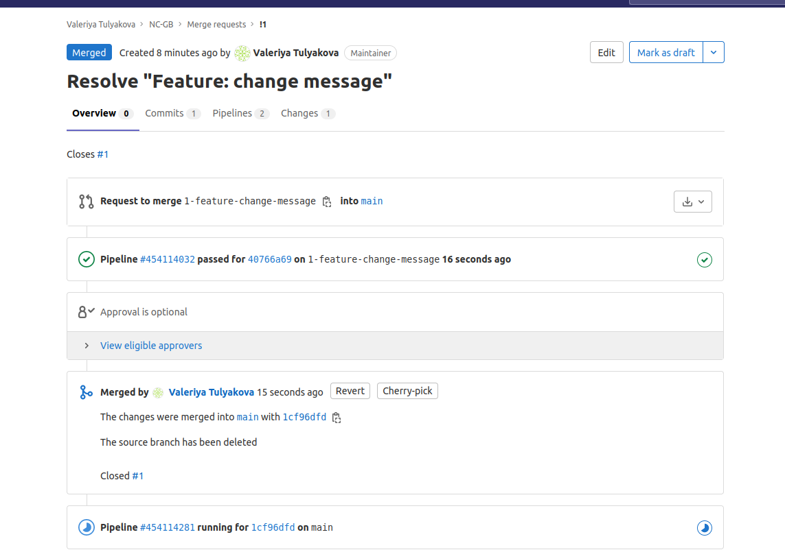

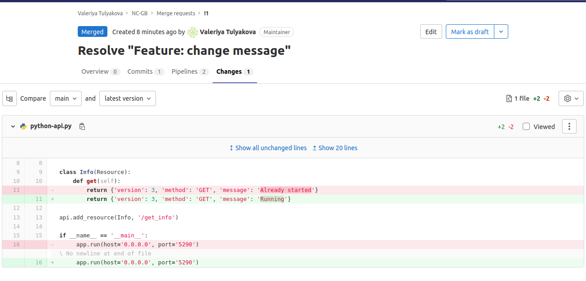

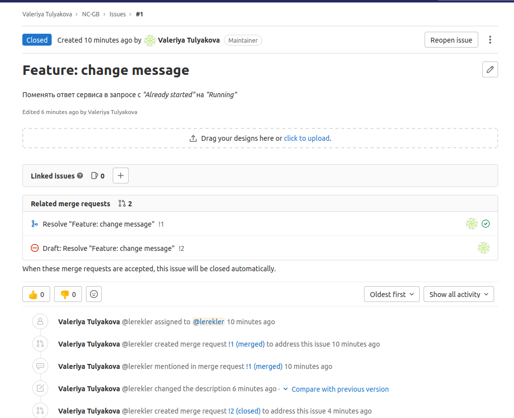

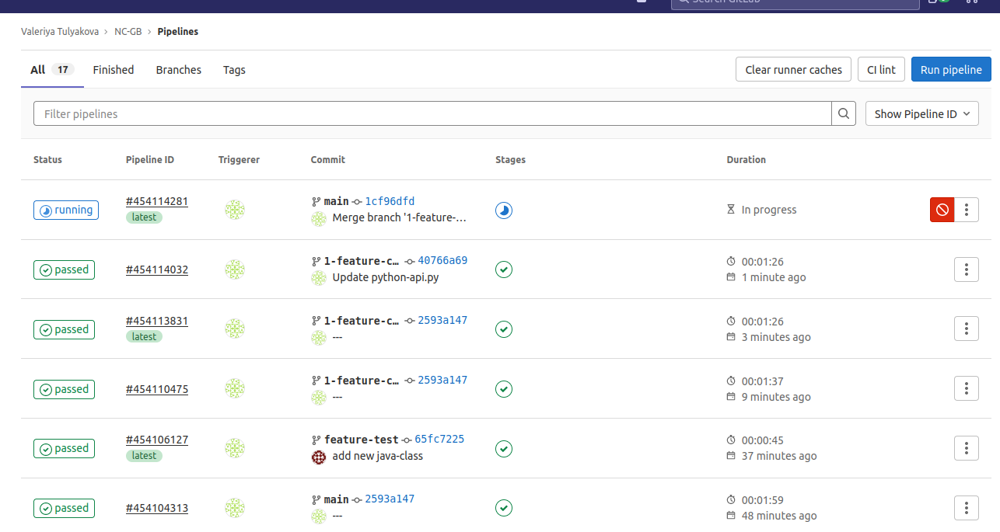

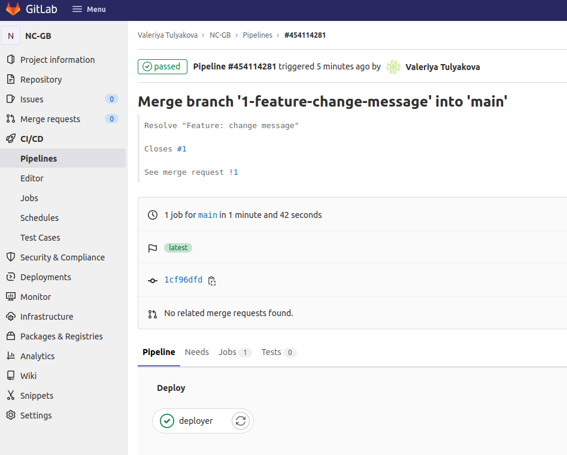

### Tester

#### Разработчики выполнили новый Issue, необходимо проверить валидность изменений:
#### 1. Поднять докер-контейнер с образом `python-api:latest` и проверить возврат метода на корректность
#### 2. Закрыть Issue с комментарием об успешности прохождения, указав желаемый результат и фактически достигнутый

```shell
netology@netology:~/Projects$ docker pull registry.gitlab.com/lerekler/nc-gb/python-api
Using default tag: latest
latest: Pulling from lerekler/nc-gb/python-api
2d473b07cdd5: Already exists 
62fcb10d106d: Pull complete 
ad5d0976adf3: Pull complete 
472a69fb9728: Pull complete 
eb57b03ab60b: Pull complete 
Digest: sha256:900e460e99f330ea6ff3a9a8011d10de66310621a47d043d891d430c80ef690c
Status: Downloaded newer image for registry.gitlab.com/lerekler/nc-gb/python-api:latest
registry.gitlab.com/lerekler/nc-gb/python-api:latest
netology@netology:~/Projects$ docker run -p 5290:5290 -d registry.gitlab.com/lerekler/nc-gb/python-api:latest 
82f558dfe5a561062327c2bf3cde18d21ff487f7743529052830f3feae7cf19f
netology@netology:~/Projects$ curl localhost:5290/get_info
{"version": 3, "method": "GET", "message": "Running"}
```
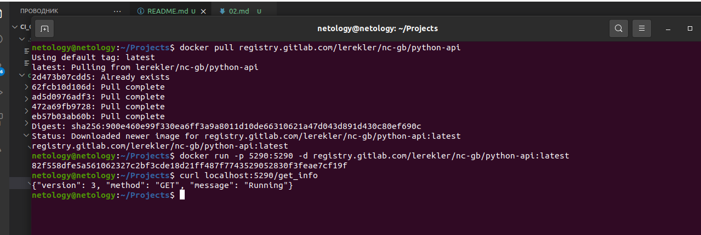

---
