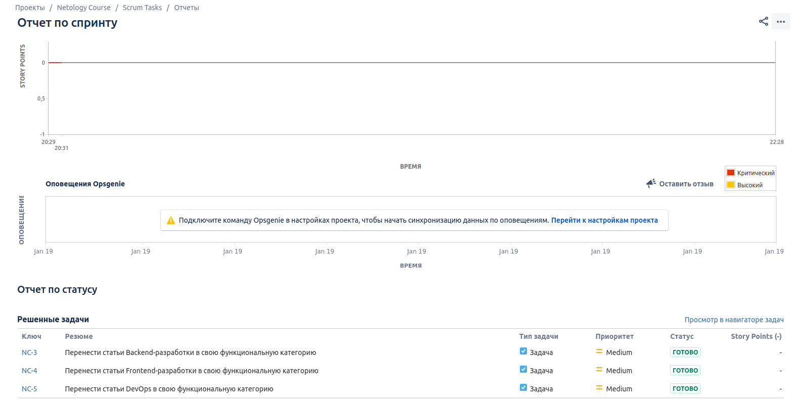

# Домашнее задание к занятию "09.01 Жизненный цикл ПО"

* [`XML`](schemes/Bugs_workflow.xml) рабочего процесса Багов
* [`XML`](schemes/Other_tasks_NC.xml) рабочего процесса остальных задач

--------------------------------------------------------------------------------------------------------------------------------

## Основная часть

--------------------------------------------------------------------------------------------------------------------------------
#### В рамках основной части необходимо создать собственные workflow для двух типов задач: bug и остальные типы задач. Задачи типа bug должны проходить следующий жизненный цикл:

    1. Open -> On reproduce
    2. On reproduce <-> Open, Done reproduce
    3. Done reproduce -> On fix
    4. On fix <-> On reproduce, Done fix
    5. Done fix -> On test
    6. On test <-> On fix, Done
    7. Done <-> Closed, Open

--------------------------------------------------------------------------------------------------------------------------------

--------------------------------------------------------------------------------------------------------------------------------
#### Остальные задачи должны проходить по упрощённому workflow:

    1. Open -> On develop
    2. On develop <-> Open, Done develop
    3. Done develop -> On test
    4. On test <-> On develop, Done
    5. Done <-> Closed, Open

--------------------------------------------------------------------------------------------------------------------------------

* Назначенные задачи:

--------------------------------------------------------------------------------------------------------------------------------

#### Создать задачу с типом bug, попытаться провести его по всему workflow до Done. Создать задачу с типом epic, к ней привязать несколько задач с типом task, провести их по всему workflow до Done. При проведении обеих задач по статусам использовать kanban. 

--------------------------------------------------------------------------------------------------------------------------------

* Задача с багом:

* Задачи в Epic'е:

* Доска Kanban по багам:

* Доска Kanban по остальным задачам:

* История изменения статуса бага после манипуляций на Kanban-доске:

* История изменения статуса одной из задач Epic'а после манипуляций на Kanban-доске:

--------------------------------------------------------------------------------------------------------------------------------

#### Вернуть задачи в статус Open. Перейти в scrum, запланировать новый спринт, состоящий из задач эпика и одного бага, стартовать спринт, провести задачи до состояния Closed. Закрыть спринт.

--------------------------------------------------------------------------------------------------------------------------------

* Scrum bugs бэклог

* Scrum bugs доска

* История изменения статуса бага после манипуляций на Scrum-доске:

* Scrum tasks доска

* Отчеты по закрытым спринтам:

