# Домашнее задание к занятию "09.03 CI\CD"

-------------------------------------------------------------------------------------------------

## Подготовка к выполнению

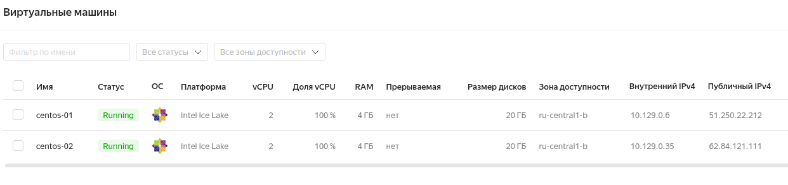

* `hosts.yml`:

```yaml
---
all:
  hosts:
    sonar-01:
      ansible_host: 51.250.22.212
    nexus-01:
      ansible_host: 62.84.121.111
  children:
    sonarqube:
      hosts:
        sonar-01:
    nexus:
      hosts:
        nexus-01:
    postgres:
      hosts:
        sonar-01:
  vars:
    ansible_connection_type: paramiko
    ansible_user: netology
```

* [Лог](logs/00.md) запуска `ansible-playbook -i inventory/cicd/hosts.yml site.yml`

* SonarQube:

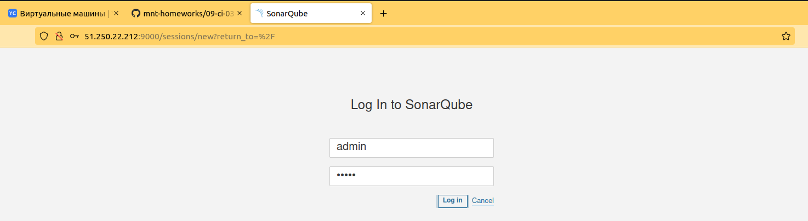

* Nexus:

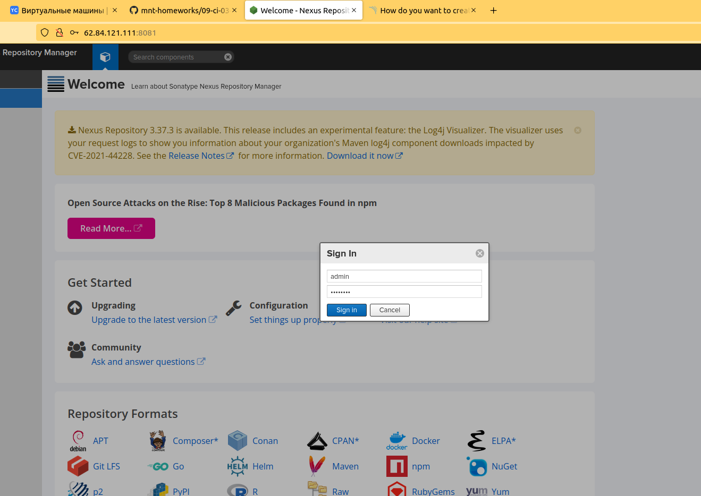

* Maven:

```shell
netology@netology:~/Projects/all_exercises$ export PATH=$PATH:/home/netology/progs/apache-maven-3.8.4-bin/apache-maven-3.8.4/bin
netology@netology:~/Projects/all_exercises$ echo $PATH
/home/netology/.local/bin:/usr/local/sbin:/usr/local/bin:/usr/sbin:/usr/bin:/sbin:/bin:/usr/games:/usr/local/games:/snap/bin:/home/netology/.local/bin:/home/netology/progs/sonar-scanner-4.6.2.2472-linux/bin:/home/netology/progs/apache-maven-3.8.4-bin/apache-maven-3.8.4/bin

```
* Убираем блокировку незащищенного соединения:

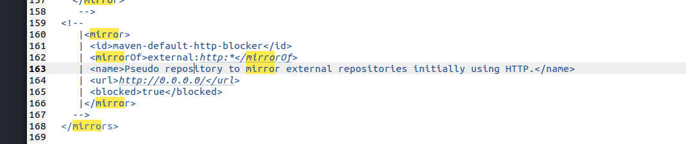

```shell
netology@netology:~/Projects/ci_cd/current_exercises/9.3ex/example$ mvn --version
Apache Maven 3.8.4 (9b656c72d54e5bacbed989b64718c159fe39b537)
Maven home: /home/netology/progs/apache-maven-3.8.4-bin/apache-maven-3.8.4
Java version: 11.0.13, vendor: Ubuntu, runtime: /usr/lib/jvm/java-11-openjdk-amd64
Default locale: ru_RU, platform encoding: UTF-8
OS name: "linux", version: "5.13.0-25-generic", arch: "amd64", family: "unix"
```

-------------------------------------------------------------------------------------------------

## Знакомоство с SonarQube

#### 1. Создаём новый проект, название произвольное

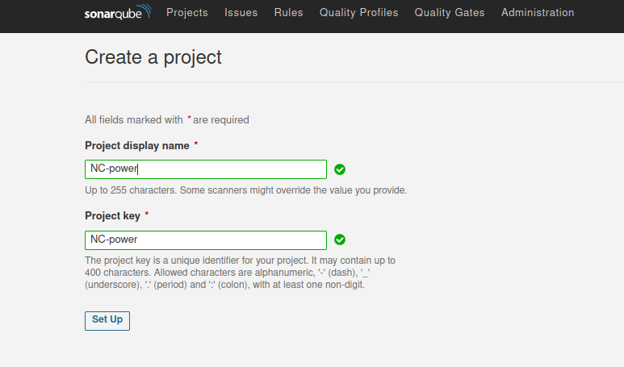

#### 2. Скачиваем пакет sonar-scanner, который нам предлагает скачать сам sonarqube
#### 3. Делаем так, чтобы binary был доступен через вызов в shell (или меняем переменную PATH или любой другой удобный вам способ)

```shell
netology@netology:~/Projects$ export PATH=$PATH:/home/netology/progs/sonar-scanner-4.6.2.2472-linux/bin
netology@netology:~/Projects$ echo $PATH
/home/netology/.local/bin:/usr/local/sbin:/usr/local/bin:/usr/sbin:/usr/bin:/sbin:/bin:/usr/games:/usr/local/games:/snap/bin:/home/netology/.local/bin:/home/netology/progs/sonar-scanner-4.6.2.2472-linux/bin
```

#### 4. Проверяем sonar-scanner --version

```shell
netology@netology:~/Projects$ sonar-scanner --version
INFO: Scanner configuration file: /home/netology/progs/sonar-scanner-4.6.2.2472-linux/conf/sonar-scanner.properties
INFO: Project root configuration file: NONE
INFO: SonarScanner 4.6.2.2472
INFO: Java 11.0.11 AdoptOpenJDK (64-bit)
INFO: Linux 5.13.0-25-generic amd64

```
* [Лог](logs/01.md) запуска команды:

```shell
sonar-scanner \
>   -Dsonar.projectKey=NC-power \
>   -Dsonar.sources=. \
>   -Dsonar.host.url=http://51.250.22.212:9000 \
>   -Dsonar.login=5562f9278f9a797a74ed5b5577314a05a4332cc7
```
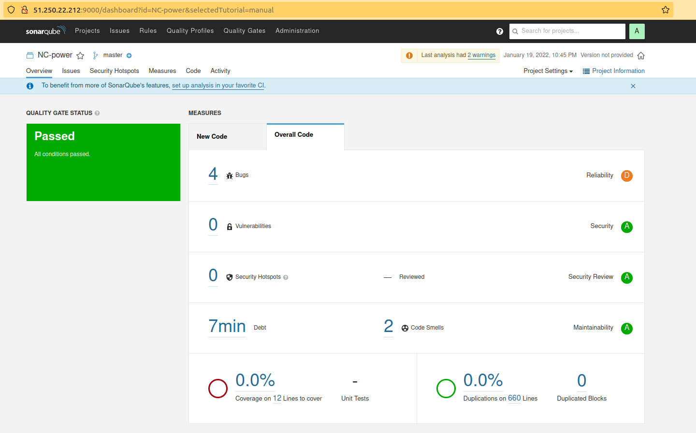

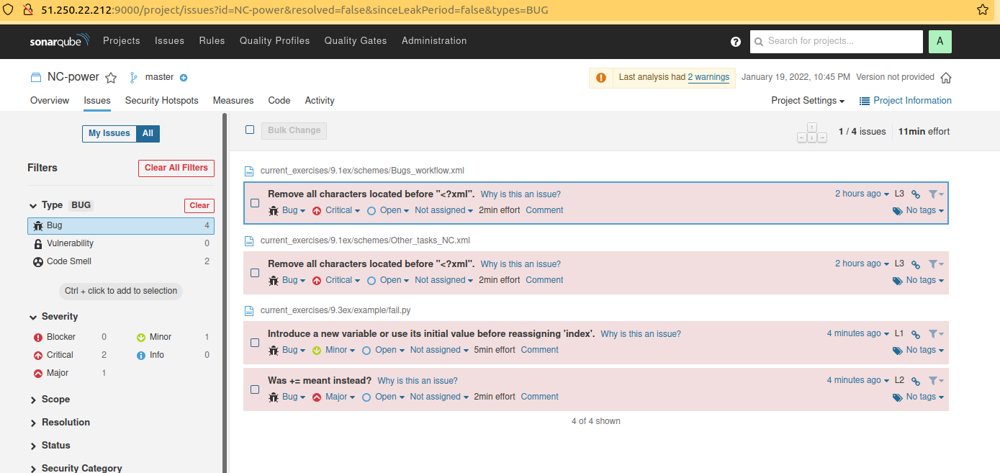

#### 5. Запускаем анализатор против кода из директории example с дополнительным ключом -Dsonar.coverage.exclusions=fail.py
* [Лог](logs/02.md) запуска команды:

```shell
sonar-scanner \
>   -Dsonar.projectKey=NC-power \
>   -Dsonar.sources=. \
>   -Dsonar.host.url=http://51.250.22.212:9000 \
>   -Dsonar.login=5562f9278f9a797a74ed5b5577314a05a4332cc7 \
>   -Dsonar.coverage.exclusions=fail.py
```

#### 6. Смотрим результат в интерфейсе

* После исключения файла статистика позитивная:

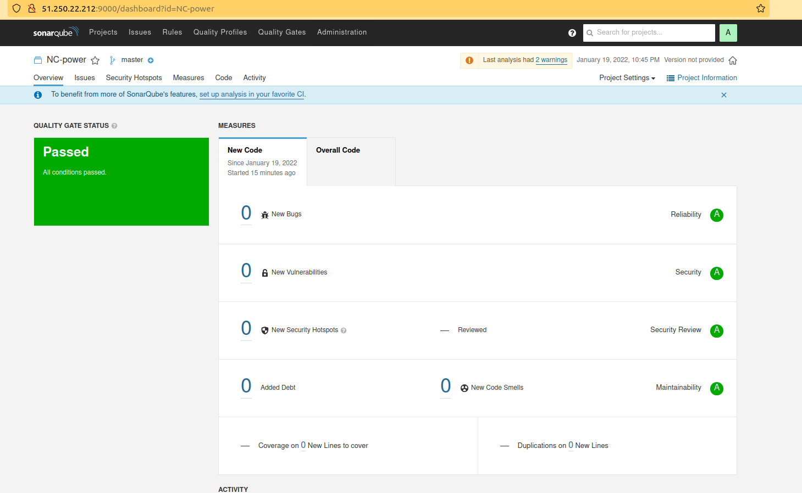

* Но баги никуда не делись (плюс захватились мои из репозитория): 

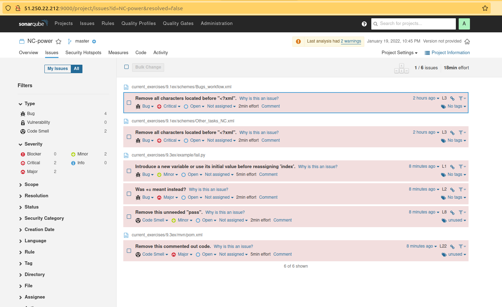


#### 7. Исправляем ошибки, которые он выявил(включая warnings)

* Скрипт после исправления:

```python
def increment(index):
    local_index = 0
    local_index += 1
    local_index += index
    return local_index
def get_square(numb):
    return numb*numb
def print_numb(numb):
    print("Number is {}".format(numb))

index = 0
while (index < 10):
    index = increment(index)
    print(get_square(index))
```

* Запуск осуществляла с `-Dsonar.python.version=2`, чтобы ушло предупреждение об отсутствии версии `python`

```shell
netology@netology:~/Projects/ci_cd/current_exercises/9.3ex/example$ 
sonar-scanner \
   -Dsonar.projectKey=NC-power \
   -Dsonar.sources=. \
   -Dsonar.host.url=http://51.250.22.212:9000 \
   -Dsonar.login=5562f9278f9a797a74ed5b5577314a05a4332cc7 \
   -Dsonar.coverage.exclusions=fail.py \
   -Dsonar.python.version=2
```
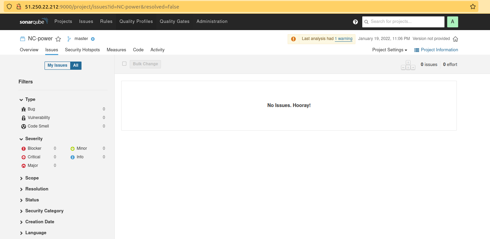

#### 8. Запускаем анализатор повторно - проверяем, что QG пройдены успешно

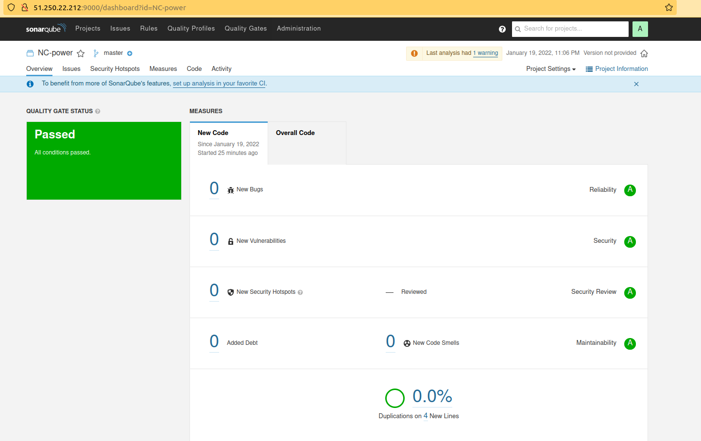

-------------------------------------------------------------------------------------------------

## Знакомоство с Nexus

* P.S. Версию 8_282 заменила на `Java SE 8 Archive Downloads (JDK 8u202 and earlier)`, т.е. `8_202` т.к. изначально думала: что это имеет какое-то принципиальное значение


#### 1. В репозиторий maven-public загружаем артефакт с GAV параметрами:
        * groupId: netology
        * artifactId: java
        * version: 8_202
        * classifier: distrib
        * type: tar.gz

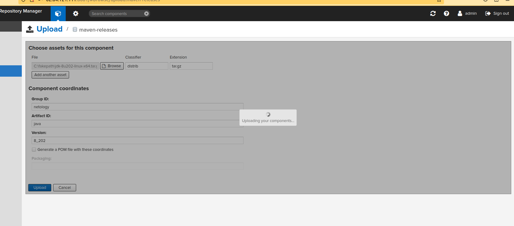

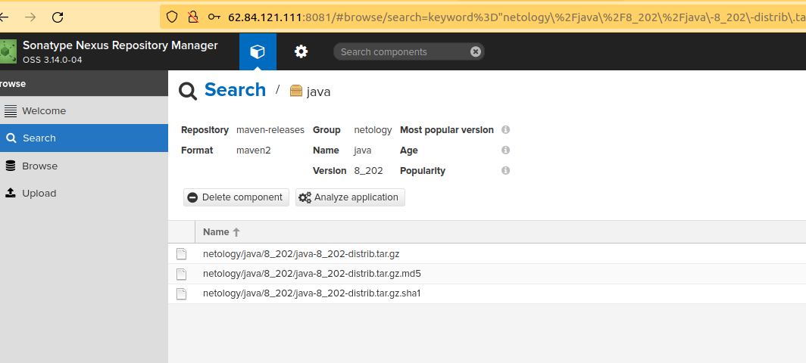


#### 2. В него же загружаем такой же артефакт, но с version: 8_102

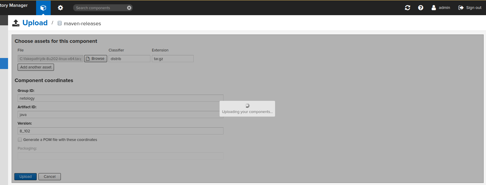


#### 3. Проверяем, что все файлы загрузились успешно

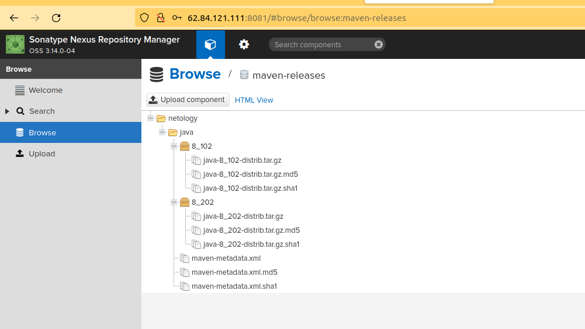

#### 4. В ответе присылаем файл maven-metadata.xml для этого артефекта

* [metadata](logs/maven-metadata.xml)

-------------------------------------------------------------------------------------------------

## Знакомоство с Maven

#### 1. Меняем в pom.xml блок с зависимостями под наш артефакт из первого пункта задания для Nexus (java с версией 8_202)

* [`pom.xml`](mvn/pom.xml)

#### 2. Запускаем команду mvn package в директории с pom.xml, ожидаем успешного окончания

* Лог запуска команды [`mvn package`](logs/03.md)

#### 3. Проверяем директорию ~/.m2/repository/, находим наш артефакт

```shell
netology@netology:~/Projects/ci_cd/current_exercises/9.3ex/mvn$ ls -l ~/.m2/repository/
итого 40
drwxrwxr-x 3 netology netology 4096 янв 19 23:59 backport-util-concurrent
drwxrwxr-x 3 netology netology 4096 янв 19 23:59 classworlds
drwxrwxr-x 3 netology netology 4096 янв 19 23:59 com
drwxrwxr-x 3 netology netology 4096 янв 19 23:59 commons-cli
drwxrwxr-x 3 netology netology 4096 янв 19 23:59 commons-lang
drwxrwxr-x 3 netology netology 4096 янв 19 23:59 commons-logging
drwxrwxr-x 3 netology netology 4096 янв 19 23:59 junit
drwxrwxr-x 3 netology netology 4096 янв 19 23:59 log4j
drwxrwxr-x 3 netology netology 4096 янв 19 23:59 netology
drwxrwxr-x 6 netology netology 4096 янв 19 23:59 org

netology@netology:~/Projects/ci_cd/current_exercises/9.3ex/mvn$ cd ~/.m2/repository/netology/
netology@netology:~/.m2/repository/netology$ tree
.
└── java
    └── 8_202
        ├── java-8_202-distrib.tar.gz
        ├── java-8_202-distrib.tar.gz.sha1
        ├── java-8_202.pom.lastUpdated
        └── _remote.repositories

2 directories, 4 files
```

